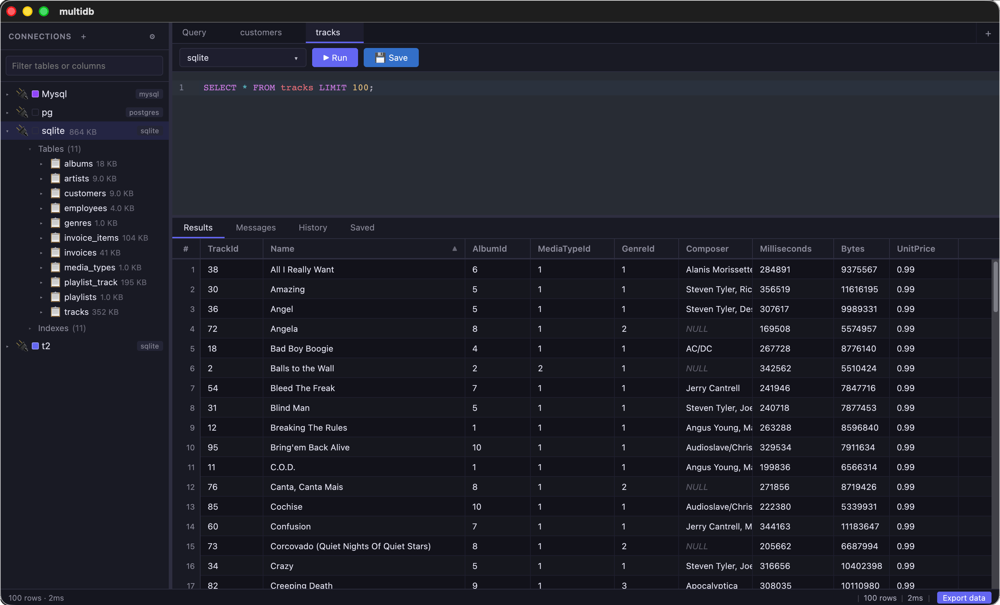

# multidb


`multidb` is a desktop SQL client for working across multiple database engines with one UI for querying, schema browsing, table backup/import workflows, and query history.

I used pgAdmin and MySQL Workbench for years, and both could be slow to load or fragile after VPN resets. `multidb` is intentionally much smaller than tools like pgAdmin, DBeaver, or MySQL Workbench: it focuses on fast startup, low memory use, quick SQL execution, exporting data, and browsing schemas without a lot of surrounding weight.

## Screenshot



## Features

- Multi-database connectivity:
  - MySQL
  - PostgreSQL
  - SQLite
- Connection management:
  - Save, edit, test, and remove connections
  - Optional Kubernetes port-forward support for database access
  - Per-connection tab color and optional black tab text
  - Connection color swatch shown in the left navigator
- SQL editor experience:
  - Native Slint SQL editor backed by a Rust rope buffer
  - Connection-aware SQL dialect switching
  - Schema-driven SQL autocomplete
  - Query cancellation support
- Query execution:
  - Streamed query results for large datasets
  - Virtualized results grid for performance
  - Column sorting and copy/select behavior
  - CSV export support
- Schema explorer:
  - Expandable navigation tree for schemas, tables, views, indexes, and columns
  - Context menu actions for viewing tables, refreshing schema, backups, drops, and imports
- Backup and import:
  - Table backup generation
  - Import from zipped SQL backup archives and PostgreSQL dump files
- Query productivity:
  - Per-connection query history
  - Saved queries with title editing
  - Quick re-open of saved/history queries into new tabs
- Persistence:
  - Local SQLite metadata store for saved connections, history, saved queries, and schema cache

## Tech Stack

- Desktop UI: Slint
- Backend: Rust
- Editor: native Slint/Rust editor model
- Database layer:
  - `sqlx` with MySQL, PostgreSQL, and SQLite support
  - Local metadata stored in SQLite

## Project Structure

- `desktop`: Slint desktop UI, Rust backend, command handlers, and persistence
- `desktop/ui/main.slint`: native desktop layout and view components
- `desktop/src/slint_app.rs`: Slint controller and async service wiring
- `desktop/src/editor.rs`: native SQL editor buffer, visible-line model, and completions
- `desktop/src/connections.rs`: connection manager, DSN logic, and Kubernetes port-forwarding
- `desktop/src/queries.rs`: query execution, cancellation, result conversion, and non-query handling
- `desktop/src/schema.rs`: schema and primary-key inspection
- `desktop/src/history.rs`: local metadata persistence in `history.db`
- `desktop/src/backup.rs`: table backup, import, pg_dump import, and drop workflows

## Prerequisites

- Rust stable
- Optional tools based on workflow:
  - `kubectl` for Kubernetes port-forwarded connections

## Development

Run the desktop app in development mode:

```bash
npm run dev
```

This starts the native Slint desktop app.

## Build

Create a production desktop build:

```bash
cargo build --release
```

On macOS, build a launchable app bundle:

```bash
scripts/build-macos-app.sh
```

The app bundle is written to `desktop/target/release/multidb.app`. Launch the `.app` bundle from Finder to avoid macOS opening Terminal for the raw `desktop/target/release/multidb` executable.

## Testing And Checks

Run Rust checks:

```bash
npm run rust:check
```

## Data Storage

Application metadata is stored in a local SQLite database (`history.db`) under the user config directory in `multidb/`.

Stored data includes:

- Saved connections
- Query history
- Saved queries
- Cached schema snapshots
- UI preferences such as connection order, server groups, and font scale

## App Icons

Desktop icon assets are committed for packaging:

- macOS icon: `build/appicon.icns`
- Windows icon: `build/appicon.ico`
- PNG icon: `build/icon.png`
